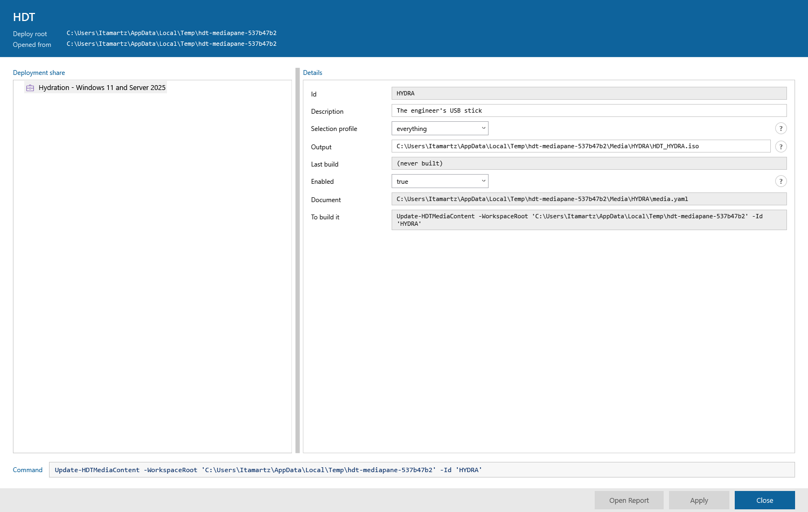

# Phase 07 Plan 05-01: The Two Media Rows That Are Picked, Not Typed — Summary

Both defects were the same mistake: a value `media.yaml` constrains to a closed
set was drawn as a box somebody types a guess into. Selection profile is now a
list of this share's profile ids, Enabled a list of `true` and `false`, and a
pick in a real WPF window is proven all the way to a bare boolean on disk and
back through `Get-HDTMedia`.

No XAML changed. The `HasChoice` DataTrigger that swaps `HDTDetailChoice` in for
`HDTDetailBox`, and the `ComboBox.SelectionChangedEvent` handler that writes a
pick, were both already in this window — built for the step editor's log level.
This was a row-builder change and a wiring change.

## What changed

**`Get-HDTConsoleMediaNode` takes `-SelectionProfile`** — the profile objects, and
it maps `.Id` itself, in one place a test can cover. It reads no document of its
own: `Get-HDTConsoleShareNode` has already read `selection-profiles.yaml` for its
own Selection Profiles category, and a second read is a second answer waiting to
disagree with the first.

**A media naming a profile the share no longer offers shows it FIRST on its own
list.** Copied from `Get-HDTConsoleStepNode`'s rule for a step resolving its scope
from a variable. An empty combo over a document that plainly names a profile reads
as "unset", and opening the list to find out what it really is would replace it.

**An empty list degrades to a text box.** `Kind` falls back to `'Text'` when
`Choice` is empty. `$Workspace.SelectionProfileFailure` is a real state, and a
combo holding nothing is a control that cannot be used at all; a box can at least
be typed into, and `Set-HDTMedia` refuses a bad id with a message naming every
legal one.

**Enabled shows `true`/`false`, not `yes`/`no`.** Those are the words the document
holds, that `Set-HDTMedia` writes (`$Enabled.ToString().ToLowerInvariant()`), and
that `Assert-HDTMediaDocument` accepts. `Get-HDTConsoleMediaEdit` keeps reading
`yes`/`no`/`1`/`0` — nothing in the pane can produce them now, but narrowing a
decision with its own file would break a hand-typed value for no gain. Only its
refusal *message* changed, to name what the list in front of a technician holds.

## The deliberate deviation: a dropdown where the house pattern is a tick box

**Every other yes-or-no in this console is `New-HDTConsoleField -Check`** — the
Options tab's Disabled and Continue on error, and a step's `wipe`, `expand`,
`recoveryPassword` and `wait`. `New-HDTConsoleField`'s own help says so in
capitals: "YES-OR-NO, WHICH IS A TICK BOX EVERYWHERE ELSE IN THIS WINDOW."

**Enabled is a dropdown anyway, because the user asked for a dropdown on this row
specifically.** It is not an oversight and it is not a row that was missed by a
consistency pass.

The alternative not taken was `-Check`, a tick box. It would have matched the six
rows named above and cost nothing to build — `New-HDTConsoleField` already
supports it, and `Get-HDTConsoleMediaEdit` would need no change at all, since a
tick box's `True`/`False` is already in its truthy/falsy lists. It was not taken
because it was not what was asked for.

The reason is recorded in the code comment above the field in those terms, so a
future sweep finds the decision rather than re-litigating it. **No other row was
changed to match, and this one should not be changed back to match the pattern.**

Worth noting for whoever reads this next: `New-HDTConsoleField`'s `Kind` already
resolves the collision cleanly — `if ($Choice.Count -gt 0) { 'Choice' } elseif
($Check) { 'Check' }`, a list wins over a tick box — so this needed no change
there either.

## The two Contexts that were deleted, and what replaced each

`HDTDetailBox` and `HDTDetailChoice` share column 1; the `HasChoice` trigger sets
the box's `Visibility` to `Collapsed` and does **not** remove it. A collapsed
TextBox is still in the visual tree, still breadth-first ahead of the ComboBox,
and still raises a real routed `LostFocus` the pane writes on. So both existing
Enabled Contexts would have gone on passing — about a control no technician can
reach. A test that is green about something unreachable is worse than a deleted
one, so they were deleted in the same commit as the change that stranded them.

| Deleted | Replaced by |
|---|---|
| `Context 'enabled, typed as no and focus moved off it'` | `Context 'false picked from the enabled list'` — strictly stronger. The old one stopped at a regex on the file; this one asserts the boolean is **bare and unquoted**, hands the file to `Assert-HDTMediaDocument`, and reads it back through `Get-HDTMedia` as a real `[bool]`. |
| `Context 'enabled, typed as a word that is not yes or no'` — which carried the pane's **refusal / `$revert` / footer** coverage | `Context 'a profile the share no longer offers, picked'`. A closed list of `true` and `false` can no longer produce a word `Get-HDTConsoleMediaEdit` rejects, so the stale profile is the **only** refusal the pane can still produce: `Set-HDTMedia` validates against `Get-HDTSelectionProfile` and refuses it, the combo goes back, the footer says why, and `media.yaml` is unchanged **byte for byte**. |

Two more Contexts were added beyond the replacement: `the pane as it is drawn`
(visibility of both controls on the same container, not mere presence) and
`the pane rebuilt, which raises SelectionChanged with nothing selected` (the
`-Picked` guard, driven through a real window for the first time).

The media Describe now builds its row from the **real** `Get-HDTConsoleMediaNode`
over `Get-HDTMedia`'s own output and `Get-HDTSelectionProfile`'s own profiles,
rather than from two hand-written fields. That matters beyond tidiness: the list
the pane offers is now provably the same list `Set-HDTMedia` validates against, so
a test cannot pass on a pick the console would refuse.

## Deviations from plan

### Auto-fixed issues

**1. [Rule 1 - Bug] My own help text broke the help parser**
- **Found during:** the full gate, after task 3
- **Issue:** a wrapped `.PARAMETER SelectionProfile` line began `.Id itself, ...`.
  A help line opening with a dot is read as a section keyword and everything after
  it is dropped. `ExampleQuality.Contract.Tests.ps1` caught it — the one failure in
  an otherwise green 14049-test run.
- **Fix:** reworded so no line opens with a dot.
- **Commit:** 3e8a75f

**2. [Rule 1 - Bug] `$profile` is a PowerShell automatic variable**
- **Found during:** `./build.ps1 lint`
- **Issue:** two new `foreach` loops assigned to `$profile`. PSScriptAnalyzer
  `PSAvoidAssignmentToAutomaticVariable`, 2 diagnostics.
- **Fix:** renamed to `$offering` in both files.
- **Commit:** 3e8a75f

**3. [Rule 1 - Bug] A test of mine that could never fail**
- **Found during:** task 2's first green run
- **Issue:** `'offers the ids and not the display names'` asserted
  `Should -Not -Contain 'Everything'`. PowerShell's `-contains` is
  case-**insensitive**, so it matched `'everything'` and the test failed against
  correct code — and, worse, would have passed against a list of display Names.
- **Fix:** rewritten with `-ceq`, which is also how the ComboBox's own
  `SelectedItem` match works, so the test now pins the behaviour that matters.
- **Commit:** cfa588f

### Plan inaccuracies found

**Evidence 10 is wrong: the bundle is not committed.** The plan says
`src/Hephaestus/Hephaestus.bundle.ps1` "is committed, and every plan in this phase
has run that task before verifying". It is in `.gitignore` (line 48: "generated by
./build.ps1 -Task bundle, **never committed**") and is not tracked. The bundle task
was run — twice, and the suite runs against the bundle — but nothing was committed
for it, and `git add` refused it. The success criterion "the bundle is in the
commit" cannot be met and should not have been written.

**Task 1's fixture note names three built-in profiles; there are two.**
`Get-HDTSelectionProfileBuiltIn` returns `all-drivers` and `everything`. Its own
`.EXAMPLE` block still advertises a third, `nothing`, which does not exist — a
stale doc line, not a defect in behaviour, and outside this plan's scope, so it was
left alone and is recorded here instead. The tests read the ids off the model
rather than naming them, so nothing depends on the count.

**Task 3's suggested `It` name used angle brackets** —
`'writes selectionProfile: <id> into media.yaml'`. Pester expands `<id>` as a
`-ForEach` data placeholder, and this `It` has no `-ForEach`, so the name alone
threw `The variable '$id' cannot be retrieved because it has not been set`.
Renamed, with the reason in a comment above it.

## Verification

Windows PowerShell 5.1 only, separate processes, `PSModulePath` unset. The pwsh 7
pass is deliberately off.

| Gate | Result |
|---|---|
| `./build.ps1 test` | **14050 passed, 0 failed, 268 skipped** across 494 files |
| `./build.ps1 lint` | **0 diagnostics** across 1150 files |

The window itself was opened and photographed with an offscreen STA
`RenderTargetBitmap` probe, not described: `07-05-01-media-detail.png` above shows
Selection profile and Enabled drawn as lists, Description and Output still boxes,
and the `?` hints beside the rows that carry one.

## Self-Check: PASSED

All six modified files exist, the capture exists, and all four work commits
(eb39f43, cfa588f, 88556d4, 3e8a75f) are present in `git log`. Checked by
execution, not by memory.
