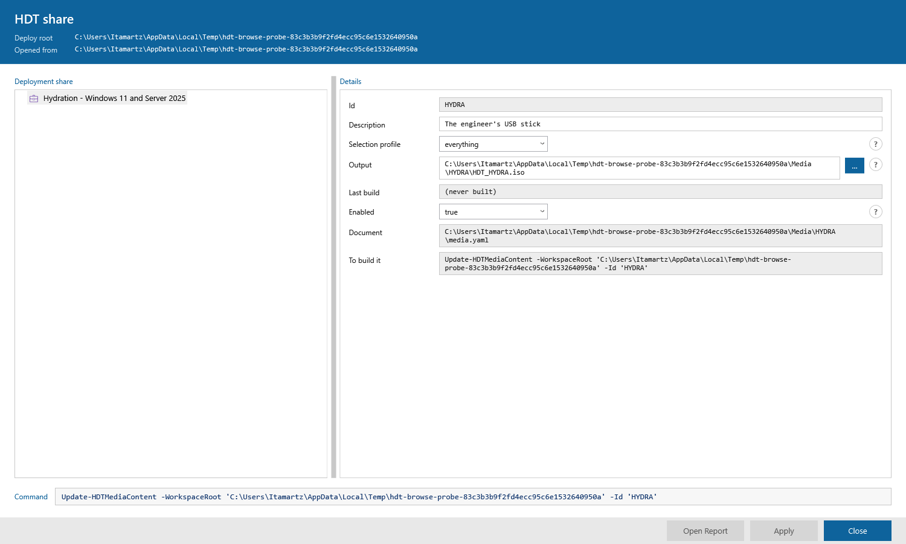

# Phase 07 Plan 05-02: The Browse Button on the Media Output Row — Summary

The details pane's Output row is an ISO path, and until now a technician typed
it from memory; it now has an ellipsis button beside it that opens a
`SaveFileDialog` and writes through the same `Set-HDTMedia` path a typed value
already did.

## What was built

**`New-HDTConsoleField -Browse 'IsoFile'`** — a field may declare that its value
is picked off a disk. Two new emitted properties, `Browse` (the kind) and
`HasBrowse` (the boolean a `DataTrigger` can compare, for the reason `HasHint`
exists), and `Kind` stays `Text` because a browse is an adjunct to a box and not
a fourth kind of row. A `-Browse` with no `-Property` is refused at build time,
and so is one alongside `-Choice`/`-Check`.

**`Get-HDTConsoleFieldBrowse`** — the one place a kind becomes a dialog. Pure:
no WPF type, no disk, `[System.IO.Path]` and never `Split-Path`. Returns
`Dialog`, `Title`, `Filter`, `FileName`, `Directory`.

**The markup** — `HDTDetailBrowseButton`, collapsed by default, shown by a
`HasBrowse` `DataTrigger`, pointed at its own row's box by
`Tag="{Binding ElementName=HDTDetailBox}"`. The help dot moved into a horizontal
`StackPanel` with it to share column 2, and its now-meaningless `Grid.Column`
came off with the re-parent.

**The handler** — a routed `ButtonBase.ClickEvent` handler on `HDTDetailList`,
beside the `TextBox` LostFocus and `ComboBox` SelectionChanged ones, ending in
the same `Test-HDTConsoleRowCommit` + `$writeRow` pair both of them use. No
second save path.



## Which dialog, and why

`SaveFileDialog`. `Update-HDTMediaContent` is what **creates** the file the
Output box names, so the only useful answer a technician can give this box is a
path to a file that does not exist yet — and `OpenFileDialog`'s
`CheckFileExists` refuses exactly that answer. `Shell.Application.BrowseForFolder`,
the driver import's precedent at `New-HDTConsoleView.ps1` ~2361, is wrong on
both counts: it picks a folder, and one that already exists. The decision is not
new here — `New-HDTConsoleHost.ps1`'s New Media dialog made it for this same
document key, with the reasoning written above its own picker; this pane is the
other door to the same box and it gets the same control. `Microsoft.Win32.SaveFileDialog`
is `PresentationFramework`, so it is clear of `WinPeUiStack.Contract.Tests.ps1`,
which bans `System.Windows.Forms` and `WindowsFormsIntegration` outright.

## The contract question the brief asked

The `*CommandText` sweep in `ConsoleSurface.Contract.Tests.ps1` (~line 588,
`It 'gives every console window somewhere to print the command it runs'`) is
already satisfied by `HDTConsole.xaml`'s `x:Name="HDTCommandText"`, and this
plan adds no window — so it needed no change and got none.

The two `ConsoleWindow.Tests.ps1` rules that **do** cover this template were
both checked against the new markup and are green: the new `Button` sets neither
a local `Foreground` nor a local `Background` (a local value beats the hover
trigger, which is the wizard workstream's trap), and there is still exactly one
`TextBox` named `HDTDetailBox` — the browse control is a `Button` and gained no
box of its own.

## The sweep (task 4B) — every other `-Property` row, and none of them changed

Every `New-HDTConsoleField` call in `src/Hephaestus` that passes `-Property`,
found by AST walk, with a verdict on whether the key it writes is a filesystem
path a Browse would help with. **None of them was changed.**

| File:line | Key | Path-shaped? | Verdict |
|---|---|---|---|
| `Get-HDTConsoleMediaNode.ps1:260` | `output` | yes | **This plan.** The ISO the next build writes. |
| `Get-HDTConsoleMediaNode.ps1:227/244/281` | `description`, `selectionProfile`, `enabled` | no | A sentence and two closed sets. |
| `Get-HDTConsoleShareNode.ps1:95` | `deployRoot` | **yes — the strongest candidate** | A folder, and a UNC one. Needs a `'Folder'` kind and `Shell.Application.BrowseForFolder` rather than a file dialog, per the WinPE UI stack contract. Not this plan's to add; the set-walking contract is what makes adding it safe later. |
| `Get-HDTConsoleShareNode.ps1:246/248` | `install`, `uninstall` | **no, and deliberately** | Command lines handed to `cmd.exe` with the application's own folder as the working directory — the very fact that row's `-Hint` exists to state. A file picker would write an absolute path and quietly break that contract. |
| `Get-HDTConsoleShareNode.ps1:81/224/370/553/738` | `name` | no | Captions. |
| `Get-HDTConsoleShareNode.ps1:102` | `logLevel` | no | A closed set. |
| `Get-HDTConsoleShareNode.ps1:230/231/232/371/554/744/745` | `publisher`, `version`, `description` | no | Metadata. |
| `Get-HDTConsoleShareNode.ps1:262/264/266` | `successCodes`, `rebootCodes`, `detect` | no | Code lists and a detection rule. |
| `Get-HDTConsoleStepNode.ps1:170` | `group` | no | A step group's caption. |
| `Get-HDTConsoleStepNode.ps1:487` | whatever the step template declares | **some — report only** | The keys are generated from the step's own property table, so a browse would have to be declared by the step template rather than by this call site — a bigger design than this plan. The path-shaped keys `Get-HDTStepPropertyDefinition` declares today: `bootImage` (Boot image), `bootstrap` (Bootstrap document), `configFile` (Exclusion list), `image` (Capture to), `script` (Script), `source` (Capture from / Payload source), `startupKey` (Startup key path), `template` and `unattend` (Answer file). Nine keys, none changed. |

## Deviations from Plan

### Auto-fixed issues

**1. [Rule 3 — Blocking] `WinPeUiStack.Contract.Tests.ps1` refuses a named
`Button` no `.ps1` under `src/` mentions**

- **Found during:** Task 3, on the first contract run after the markup landed.
- **Issue:** `It 'names no button the engine never mentions'` failed with
  `Found: HDTDetailBrowseButton`. The plan's handler reaches the button through
  a routed event and `Tag`, never by name — so nothing in `src/` named it, and
  the contract is right that "a button no engine code names is one a technician
  can press and nothing happens". Every other button on these windows is
  reached by `FindName`; this one is reached by a route that genuinely can
  serve nothing.
- **Fix:** A real third guard rather than a comment —
  `if ([string] $button.Name -ne 'HDTDetailBrowseButton') { return }`, placed
  immediately after the `Button` cast. `x:Name` inside a `DataTemplate` sets the
  instance's `Name` as well as registering it in the template's name scope, so
  a click arriving by routed event can say which control it came from. It also
  makes the handler correct the day the template gains a second `Button`. One
  matching assertion added to `ConsoleFieldEdit.Tests.ps1`.
- **Files modified:** `src/Hephaestus/Private/New-HDTConsoleView.ps1`,
  `tests/unit/ConsoleFieldEdit.Tests.ps1`
- **Commit:** `76659de`

**2. [Rule 1 — Bug, in a test written this plan] `Should -BeLike '*\*.iso*'`
cannot match a dialog filter**

- **Found during:** Task 2's first green run.
- **Issue:** A test of my own asserted the `.iso` filter with `-BeLike` and a
  backslash escape. `-like`'s wildcard escape is a **backtick**, not a
  backslash, so the pattern asked for a literal `\` and failed against a filter
  that was perfectly correct.
- **Fix:** `Should -Match '\*\.iso'` / `'\*\.\*'`, with the reason in a comment
  so the next person does not "fix" it back.
- **Commit:** `a882012`

### Deliberate departures from the plan text

**1. The plan's task 1 required "every new `It` fails".** One did not:
`still builds every row that asks for no browse exactly as it did` is a
regression guard over eleven unchanged emitted properties, so it must be green
before and after by construction. Kept, with that noted here rather than
weakened into something that could fail.

**2. `refuses a kind that is not in the set` was strengthened mid-RED.** As
written it was `Should -Throw` with no message, which passed before
`Get-HDTConsoleFieldBrowse` existed at all — `CommandNotFoundException` is an
exception too. That is a test green about nothing, so it now asserts
`'*does not belong to the set*'`.

**3. Task 4's sanity check found assertion (1) STRONGER than the plan
predicted.** The plan said deleting `-Browse` from the media Output row would
leave `gives every field that declares a Browse kind a dialog to open` passing.
It does not: the `It` carries a
`Should -BeGreaterThan 0 -Because 'a sweep that found no browsing field would
pass without looking at anything'` guard, so it fails. All three mutations were
run for real and all three went red — see below — and every one was reverted
with `git checkout` and the bundle rebuilt.

**4. `Hephaestus.bundle.ps1` is NOT in any commit**, contrary to the plan's last
success criterion. It is gitignored — `git add` refused it by name. It was
rebuilt with `./build.ps1 -Task bundle` after every `src/` change, four times,
and the final rebuild is on disk; it is a build artifact this repository does
not track.

## The sanity check, run for real

The plan required each new contract assertion to be shown capable of failing.
Each mutation was applied to the working tree, `ConsoleSurface.Contract.Tests.ps1`
run, and the file restored with `git checkout`:

| Mutation | Result |
|---|---|
| `-Browse 'IsoFile'` deleted from the media Output row | `gives every field that declares a Browse kind…` **FAILED** (14 passed / 1 failed) |
| `HasBrowse` `DataTrigger` repointed at `HasHint` | `draws the browse button and the trigger that shows it` **FAILED** (14 / 1) |
| `Get-HDTConsoleFieldBrowse` swapped for another helper in the handler | `wires a click on it, in the pane that holds it` **FAILED** (14 / 1) |

## What no test here proves

**The `SaveFileDialog` itself is exercised by no Pester test in this plan, and
that gap is on record rather than hidden.** `ShowDialog` is modal and there is
no desktop under Pester, so what `ConsoleFieldEdit.Tests.ps1` proves is the
**wiring** — the button is drawn on the Output row and on no other, points at
the box on its own row, and carries the name the handler guards on — and the
**write** — a path with a space in it, `D:\Builds\field kit.iso`, put into that
box and committed, reaches `media.yaml`, is accepted by
`Assert-HDTMediaDocument` and is read back by `Get-HDTMedia`. A comment above
that Context says so. **07-05-03's live probe is what proves the dialog opens,
is filtered to `.iso`, and writes nothing on cancel.**

The one behaviour that a Pester test *does* cover and that would otherwise be
trusted rather than tested: `ButtonBase.Click` **bubbles**, and 07-05-01 put two
`ComboBox`es in this same pane. A `ComboBox`'s arrow is a `ToggleButton`, which
raises `ButtonBase.ClickEvent` and derives from `ButtonBase` and **not** from
`Button` — so the handler's cast drops it. The test raises the real bubbling
event off **both** arrows and asserts `media.yaml` is unchanged byte for byte.
Without it, widening the guard to `ButtonBase` to "be safe" would go green and
route a click on the Enabled list into `$writeRow`.

## Verification

Windows PowerShell 5.1 only, separate processes, `PSModulePath` unset, no tree
edits during the run:

```
./build.ps1 test   ->  14090 passed, 0 failed, 268 skipped   BUILD SUCCEEDED
./build.ps1 lint   ->  0 diagnostics across 1152 file(s)     BUILD SUCCEEDED
```

The UI change was photographed, not described: an offscreen STA
`RenderTargetBitmap` probe with `ProcessRenderMode = SoftwareOnly`, rendering
the window's content with no desktop involved.

## Commits

| Commit | What |
|---|---|
| `53e79d2` | `test(07-05-02)` — 16 RED `It`s across `ConsoleFieldBrowse` and `ConsoleMediaNode` |
| `a882012` | `feat(07-05-02)` — the row builder, the mapper, the media Output row |
| `76659de` | `feat(07-05-02)` — the markup, the trigger and the click handler |
| `dd92b74` | `test(07-05-02)` — four contract assertions over the SET |

## Self-Check: PASSED

Every file this summary claims exists on disk; every commit hash it names
resolves in `git log`.
