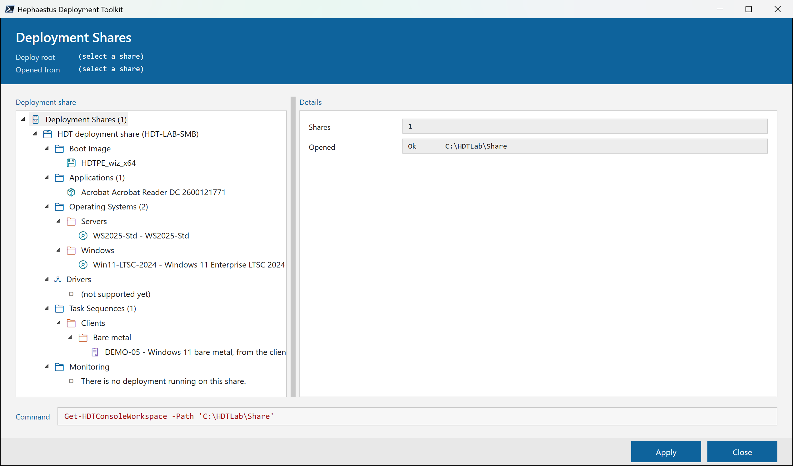
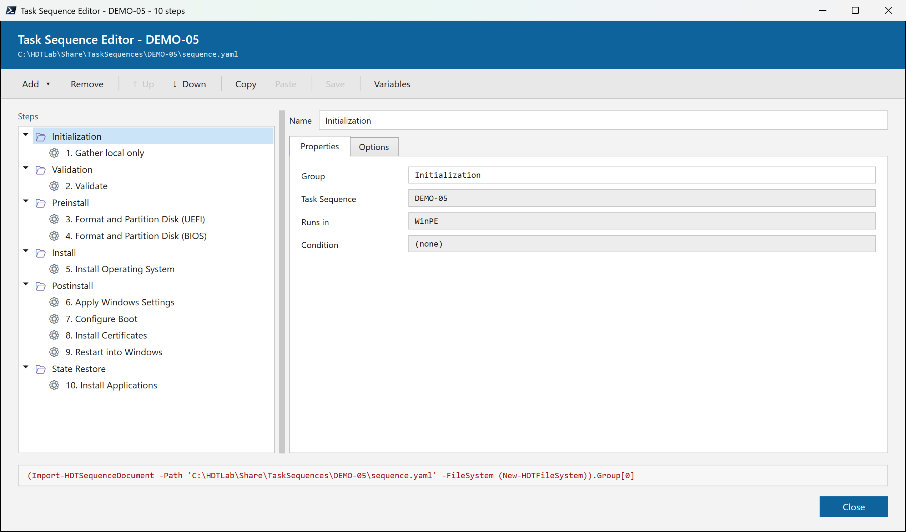
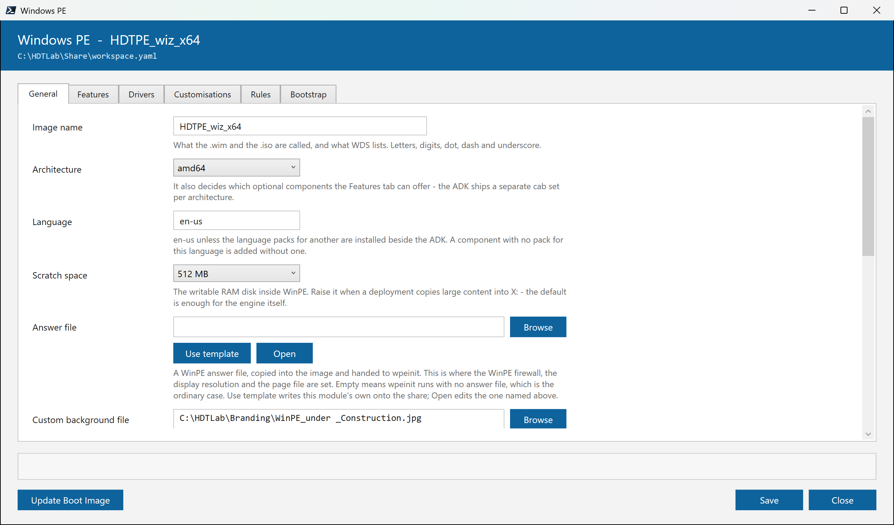
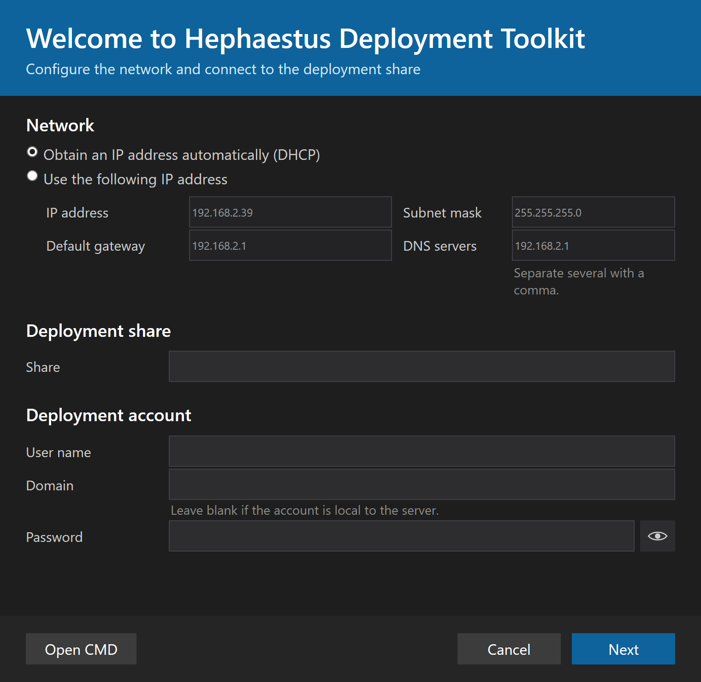

# Hephaestus Deployment Toolkit (HDT)

[](https://github.com/itamartz/HDT/actions/workflows/ci.yml)
[](https://github.com/itamartz/HDT/actions/workflows/ci.yml)
[](https://github.com/itamartz/HDT/actions/workflows/ci.yml)

A replacement for the Microsoft Deployment Toolkit, which has been in maintenance
mode since 2019. HDT keeps MDT's operational model — deployment share, task
sequences, driver store, application catalog — and rebuilds the engine on
PowerShell instead of VBScript/WSH.

**HDT depends on no MDT component.** The Windows ADK and WDS are used, and
nothing else from Microsoft's deployment stack.



## The console

Deployment Workbench, by another name — and it may not do anything the cmdlets
cannot. Every row prints the exact command it would run along the bottom, so
clicking through the window teaches the automation surface.

```powershell
Start-HDTConsole -Detach 'C:\HDTLab\Share'
```

A task sequence is a YAML document, and the editor splices lines into it rather
than re-serialising, so the comments in it survive a Save.



The boot image's settings are the `bootImage` block of `workspace.yaml`. **Save**
writes that file and is instant; **Update Boot Image** mounts a WIM, injects,
exports and builds an ISO, and takes minutes.



What the machine itself shows is the same WPF markup loaded the same way, in
WinPE, where there is no `pwsh` and no code-behind — the Welcome screen when a
machine cannot reach the share, so a static address can be typed and retried.



## The PowerShell 5.1 constraint

The engine runs inside WinPE, and WinPE ships Windows PowerShell 5.1 only —
there is no `pwsh` there. Everything under `src/Hephaestus/` must therefore parse
and run under 5.1. No `??`, no `?.`, no ternary, no `ForEach-Object -Parallel`,
no `$PSStyle`, no `clean` blocks, no `ConvertFrom-Json -AsHashtable`.

5.1 is also the edition the gate runs under. CI used to run a matrix over both
engines; a green `pwsh` leg proves nothing WinPE cares about, and a red one
blocks a merge over a shell the product never runs under.

## Repo layout

```
src/Hephaestus/     PowerShell module - the engine AND the WPF console
schemas/            JSON Schema per YAML file type
tests/unit/         Majority of tests - pure logic against fakes
tests/contract/     Schema, naming, no-MDT, PS 5.1 syntax, provider contracts
tests/integration/  Real DISM/VHDX/ADK
tests/e2e/          Hyper-V
tests/fixtures/     Real .inf headers, captured CIM shapes, sample workspaces
tests/helpers/      HDTTestTools - shared build and test helpers
samples/            Example workspaces and sequences
docs/               DESIGN.md, ROADMAP.md
```

## Building and testing

```powershell
./build.ps1 -Task test       # unit + contract suites (the default task)
./build.ps1 -Task lint       # PSScriptAnalyzer over every HDT source file
./build.ps1 -Task build      # validate the manifest and stage the module to out/
./build.ps1 -Task clean      # remove out/
./build.ps1 -Task selfcheck  # prove the harness catches a failing test
./build.ps1 -Task ci         # clean -> build -> lint -> test -> selfcheck
```

Tasks always run in the canonical order
`clean -> build -> lint -> test -> selfcheck`, whatever order they are given in.
The script exits 0 on success and 1 on failure.

Verify under Windows PowerShell 5.1 before calling anything done — that is the
edition WinPE ships and the one CI gates on:

```powershell
& "$env:SystemRoot\System32\WindowsPowerShell\v1.0\powershell.exe" -NoProfile -File ./build.ps1 -Task test
```

`test` deliberately does not depend on `lint`: PSScriptAnalyzer is not importable
under Windows PowerShell 5.1 on every machine, and the exit criterion is that
`test` passes under 5.1. `lint` fails with an actionable message where the
analyzer is unavailable, so `./build.ps1 -Task ci` is expected to fail under 5.1
on such a machine — and to pass in CI, where the workflow installs the analyzer.

Pester imports are pinned — `-MinimumVersion 5.0.0 -MaximumVersion 5.99.99`.
Pester 6.0.0 is installed on some machines and wins a bare import under 5.1.

## The harness proves itself

`./build.ps1 -Task selfcheck` does not test the product; it tests the test
harness, because a suite nobody has watched go red is not a suite. It runs the
deliberately red and deliberately green fixtures in `tests/selfcheck/` and the
deliberately dirty `tests/fixtures/analyzer/AnalyzerBait.ps1`, and fails unless:

1. the failing fixture fails,
2. the passing fixture passes,
3. a **child process** running the failing fixture exits non-zero — the exit-code
   path CI depends on, which cannot be observed from inside the run under test,
4. PSScriptAnalyzer reports violations for the bait, including
   `PSUseCompatibleSyntax`, which proves the 5.1 target version in
   `PSScriptAnalyzerSettings.psd1` is in force.

Check 4 is skipped with a warning where the analyzer cannot be imported.
`tests/selfcheck/` is never in `Run.Path` for `test`, so those fixtures can never
turn the real suite red. See `tests/helpers/README.md` section 9.

## Continuous integration

`.github/workflows/ci.yml` runs on `windows-latest` under `shell: powershell`,
which *is* Windows PowerShell 5.1 — the edition the engine has to work under.
Module versions are pinned, and the workflow runs `./build.ps1 -Task ci
-Coverage`, the same entry point developers use; CI never grows its own build
logic (DESIGN §12.2.5).

### Reports

```powershell
./build.ps1 -Task test -Coverage
```

writes three things into `out/`:

| Path | What it is |
|---|---|
| `out/testResults/pester-<edition>-<version>.xml` | NUnit results — one file per engine, so two runs cannot overwrite each other |
| `out/coverage/coverage.xml` | JaCoCo coverage of `src/Hephaestus` |
| `out/badges/{tests,coverage}.json` | shields.io endpoint documents — the numbers on the badges above |

Both XML files are uploaded as artifacts of every run, pass or fail, and the two
numbers are written to the run's own summary page.

Coverage measures **the engine only** — coverage of a test file is a tautology,
and coverage of the fakes measures the harness rather than the product. It runs
on Pester's profiler rather than its breakpoint tracer (`UseBreakpoints = $false`),
which is the difference between a slower suite and an unusable one. It is off by
default: a developer running one file should not pay for a number nobody is
going to read.

The badges are not fetched from a coverage service. The build writes the two
endpoint documents, CI pushes them to the orphan `badges` branch, and shields.io
renders them from the raw URL — so no account is signed up to, no token is
stored, and the numbers come from the run that produced them.

## Variables and rules

HDT replaces `CustomSettings.ini` + `ZTIGather` with `rules.yaml` and a
five-source resolution engine — and, unlike MDT, it tells you *why* every
variable ended up as it did.

```powershell
Import-Module ./src/Hephaestus/Hephaestus.psd1

$fact  = Get-HDTMachineFact -CimProvider (New-HDTCimProvider) `
                            -RegistryService (New-HDTRegistryService) `
                            -EnvironmentProvider (New-HDTEnvironmentProvider)
$rules = Import-HDTRuleDocument -Path 'X:\Deploy\rules.yaml' -FileSystem (New-HDTFileSystem)
$r     = Resolve-HDTVariable -RuleDocument $rules -Fact $fact -ScriptInvoker (New-HDTScriptInvoker)

Get-HDTVariableProvenance -Resolution $r | Format-Table Order, Name, Value, Source, Rule -AutoSize
```

```
Order Name              Value            Source       Rule
----- ----              -----            ------       ----
    1 HDTComputerName   PC-FIXTURE-SERIAL-0001  Rule         Fallback
    2 HDTJoinWorkgroup  WORKGROUP        Rule         Fallback
    3 HDTMake           LENOVO           GatheredFact
```

Sources, highest precedence first: `CommandLine`, `MachineOverride`, `Rule` /
`RuleScript`, `GatheredFact`, `SequenceDefault`. Nothing overwrites a variable an
earlier source resolved, so a later rule can only act as a fallback. The same
records go to `<_HDTLogPath>\Gather\provenance.json` via
`Export-HDTVariableProvenance`.

See [samples/README.md](samples/README.md) for a workspace to copy.

## Task sequences

A sequence is a `sequence.yaml` under `TaskSequences\<id>\`: groups, steps,
conditions, retry, and reboots that resume where they left off.

```yaml
schemaVersion: 1
id: DEMO-M2
name: M2 demonstration
variables:
  HDTInstallStage: none

steps:
  - group: Preinstall
    steps:
      - name: Record Stage
        type: SetVariable
        variables:
          HDTInstallStage: preinstall
      - name: Flaky Preflight
        type: NoOp
        retry: { count: 2, delaySeconds: 5, backoff: exponential }
      - name: Reboot Into Install
        type: Restart

  - group: State Restore
    condition: '"%_HDTPhase%" == "FullOS"'      # note the single quotes
    steps:
      - name: Corp Baseline
        type: PowerShell
        script: Scripts\Set-CorpBaseline.ps1
```

**The five step types M2 ships:** `NoOp` (the test step), `SetVariable`,
`PowerShell` (a script from `Scripts\`, with its `Write-Host` output captured),
`CommandLine` (`command:` is the bare line — the step wraps it in `%ComSpec% /c`
itself) and `Restart`. Imaging, drivers, applications and Windows Update arrive
in later phases; a sequence that names one of them imports and validates today
and `Test-HDTTaskSequence` reports the missing type as an `Error` finding.

**Common properties on any step:** `condition`, `continueOnError`,
`timeoutMinutes`, `runIn` (`WinPE` | `FullOS` | `Any`), `retry`, `resumable`,
`log`.

A condition is `<operand> <operator> <operand>` with `==`, `!=`, `-eq`, `-ne`,
`-like`, `-notlike` — a closed grammar, not an expression language, so a
sequence file can never execute code. It is written as a **single-quoted YAML
scalar**, because the grammar itself carries double quotes.

Running one against fakes — no machine, no reboot, nothing real:

```powershell
Import-Module ./src/Hephaestus/Hephaestus.psd1 -Force
Import-Module ./tests/helpers/HDTFakes/HDTFakes.psd1 -Force
Import-Module ./tests/helpers/HDTTestTools/HDTTestTools.psd1 -Force

$harness = New-HDTSequenceTestHarness -Yaml (Get-Content ./samples/workspace/TaskSequences/DEMO-M2/sequence.yaml -Raw)
$run     = Invoke-HDTTaskSequence -Sequence $harness.Sequence -Context $harness.Context -State $harness.State

$run.Result | Format-Table Index, Name, Type, Status, Attempt, Reason -AutoSize
```

Reading the run afterwards:

```powershell
Start-Process (ConvertTo-HDTReport -JsonlPath 'C:\HDT\Logs\HDT.jsonl' `
                                   -Path 'C:\HDT\Logs\report.html' `
                                   -FileSystem (New-HDTFileSystem) -State $run.State)
```

That is one self-contained HTML file — inline CSS, no script, no network — with
the run, the counts, every step in order with its status, attempts, duration and
exit code, the reboot legs as a timeline, every variable resolution with its
source, and the whole log. It renders from a log that was truncated by a machine
dying mid-write, and it never contains the deployment password.

## Status

**Phase 01 (M0 — skeleton and harness) is complete.** The module skeleton, the
`HDTTestTools` and `HDTFakes` helper modules, `build.ps1`, the naming /
PowerShell 5.1 / no-MDT contract tests, the first service fakes and their
contracts, the harness self-proof and CI are all in place. `./build.ps1 -Task
test` is green on a clean clone under both engines.

**Phase 02 (M1 — variables and rules) is complete.** Fact gathering behind
`ICimProvider`, the `rules.yaml` parser and schema, the five-source resolution
engine with `%Var%` expansion and `setFrom:` script rules, and provenance —
queryable with `Get-HDTVariableProvenance` and written to `provenance.json`. The
M1 exit criterion is demonstrated end to end in
`tests/unit/GatherAndResolve.EndToEnd.Tests.ps1`, over fixtures and fakes only.

**Phase 03 (M2 — task sequence engine) is complete.** `sequence.yaml` with its
schema, groups, nesting and the closed condition grammar; the step contract and
its discovery convention; the execution loop with `runIn`, conditions,
`continueOnError`, retry with backoff and timeout detection; the state document
with a checkpoint either side of every step; the autologon lifecycle with a
per-deployment password in an LSA secret, `AutoLogonCount`, a boot-time reconcile
and teardown from `finally`; structured JSONL + CMTrace logging; and
`ConvertTo-HDTReport`. The M2 exit criterion is demonstrated twice: by
`tests/unit/TaskSequence.EndToEnd.Tests.ps1`, which runs the `DEMO-M2` sample
across three legs and two reboots against fakes and asserts the exact ordered
list of operations it would have performed on a machine, and by a live run of the
same sequence against the real filesystem, clock and process service whose report
was opened in a browser.

## Test-driven, without exception

A failing Pester test exists before the implementation it covers. Every time.
The sole exception is thin adapters over external tools (DISM, CIM, oscdimg,
registry), which must stay branch-free precisely because they are not unit
tested.

## Command naming

**Every PowerShell command in HDT is named `Verb-HDTNoun`, with `HDT` uppercase**
— public cmdlets, private helpers, adapters, test helpers and build functions
alike. Approved verbs only, singular nouns.

The engine dot-sources user scripts from `Scripts\` and third-party step types
from `Modules\` inside WinPE, so an unprefixed `Invoke-Dism` is a live collision
risk. This is enforced by a contract test in `tests/contract/`, not by review.

## Documentation

- [docs/DESIGN.md](docs/DESIGN.md) — the technical design. Authoritative.
- [docs/ROADMAP.md](docs/ROADMAP.md) — milestones M0–M8, each with a
  "Tests first" list and exit criteria.
